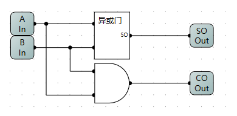

# 计算机组成原理
## 概述
    基于自己理解事物方式的Markdown记录文件


------------


## 先验知识
    - LogicCircuit的使用

------------


## CPU
    接收指令的输入，并执行命令的硬件

------------


## 基本结构
### MOSFET
	金属氧化物半导体场效应晶体管
	可以简单理解为二极管
工作原理参考视频
- [【硬件科普】带你认识CPU第00期——什么是MOSFET](https://www.bilibili.com/video/BV1nL411x7jH/?spm_id_from=333.999.0.0&vd_source=2594c47e1498b8f57a81cb311c989aed)

------------


## 逻辑门
    与门 (*)
| A(输入) | B(输入) | C(输出) |
| - | - | - |
| 0 | 0 | 0 |
| 1 | 0 | 0 |
| 0 | 1 | 0 |
| 1 | 1 | 1 |

    或门(+)
| A(输入) | B(输入) | C(输出) |
| - | - | - |
| 0 | 0 | 0 |
| 1 | 0 | 1 |
| 0 | 1 | 1 |
| 1 | 1 | 1 |
    非门
| A(输入) | C(输出) |
| - | - |
| 0 | 1 |
| 1 | 0 |

------------


## 半加器
    一位二进制加法真值表如下
| A | B | S(和) | C(进位) |
| - | - | - | - |
| 0 | 0 | 0 | 0 |
| 0 | 1 | 1 | 0 |
| 1 | 0 | 1 | 0 |
| 1 | 1 | 0 | 1 |

$$ S = A\bigoplus B$$
$$ C = AB $$

	逻辑电路的实现

 

------------

## 全加器
| A | B | $$ C_1 (进位) $$ |S(和) | $$C_2(进位)$$ |
| - | - | - | - | - |
| 0 | 0 | 0 | 0 | 0 |
| 0 | 0 | 1 | 1 | 0 |
| 0 | 1 | 0 | 1 | 0 |
| 1 | 0 | 0 | 1 | 0 |
| 1 | 1 | 0 | 0 | 1 |
| 0 | 1 | 1 | 0 | 1 |
| 1 | 0 | 1 | 0 | 1 |
| 1 | 1 | 1 | 1 | 1 |
$$ S = A\bigoplus B \bigoplus C_1 $$
$$ C = AB+AC_1+BC_1$$

	处理进位的加法器

 


------------


## 一字节全加器

 

    其他实现方式 - 基于寄存器

------------


## 减法

    按位取反

$$ A_i = \overline{ A_i } $$


    一字节加减器的实现


参考视频
- [【硬件科普】带你认识CPU第04期——CPU是怎么计算减法的](https://www.bilibili.com/video/BV1fr4y1S7gG/?spm_id_from=333.999.0.0&vd_source=2594c47e1498b8f57a81cb311c989aed)

------------


## 十六进制的数码管显示
    八位数码管的实现


    八位数码管ROM数据


    十六进制数码管的实现

 

    十六进制数码管ROM数据

 

------------

## R-S触发器
    触发器是构成时序逻辑电路以及各种复杂数字系统的基本逻辑单元。
    与非门或或非门亦可实现


## D触发器


------------

## 时序逻辑电路
    上升沿触发器


    T触发器


    行波计数器


    一字节存储器


    八位三态门


    一字节寄存器


    三八译码器


    八字节寄存器


------------

## 寄存器扩展

    位扩展寄存器16*1


    字扩展寄存器8*2


------------

## 开关

    开关的实现


## 自动化加法器

    自动化加法器的实现


    程序计数器


## 微程序

    控制器


    微程序


    微程序ROM数据


    ROM内的数据可通过程序设计生成,相关代码如下

```


```


# 其他
## 硬件描述语言
- Verilog HDL

------------

## 相关书籍
- 深入理解计算机系统

------------
